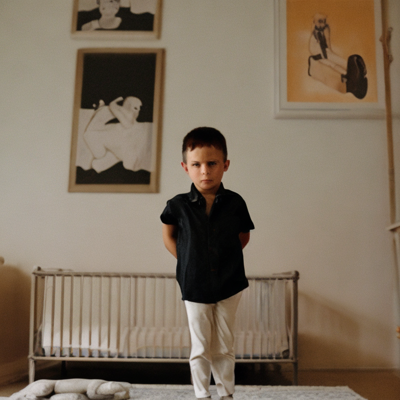

# Image Generation with Stable Diffusion

This repository contains code to generate images using the Stable Diffusion model. The model takes a text prompt as input and generates an image based on the prompt.

## Author

- **Name:** Muhammad Yousaf
- **Email:** yousafsahiwal3@gmail.com

## Setup

Ensure you have the required libraries installed. 

## Configuration

The `CFG` class contains configuration settings for the image generation process.

## Generating Images

The `generate_image` function generates an image based on a given text prompt.

### User Input

The user is prompted to enter text for image generation.

## Example Output

Here are a few examples of generated images:

## Video Demonstration

Check out the video demonstration of the output on LinkedIn:

[LinkedIn Video](https://www.linkedin.com/video_url)

For further details and collaboration, feel free to contact me via email.

*Note: Replace 'YOUR_HF_TOKEN' with your actual Hugging Face token.*
